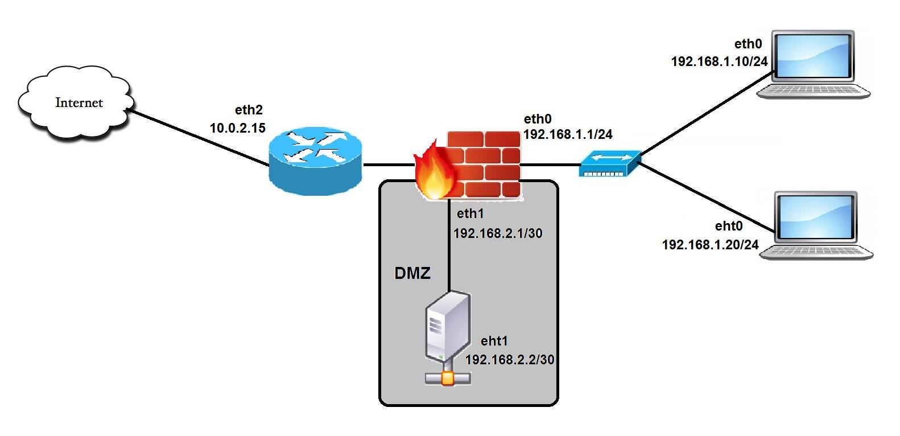
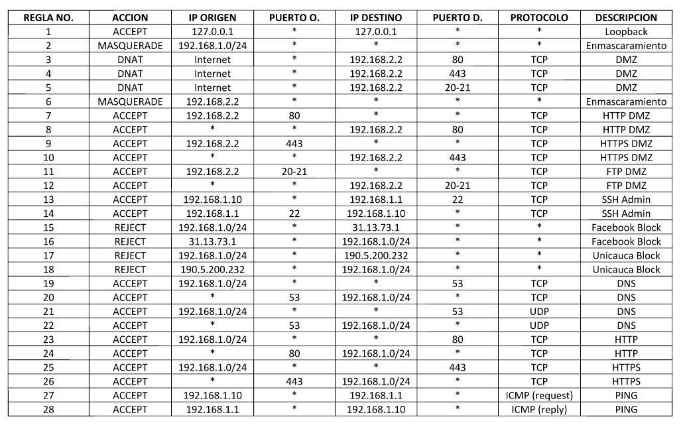

# Firewall

Script en bash para configurar un Firewall de Linux usando iptables.

## Diseño de red

La red consiste de 4 máquinas:
* **Firewall:** Con 3 interfaces de red. Corre sobre Debian sin interfaz grafica.
* **Administrador:** El administrador de la red y del firewall. Tiene la ip 192.168.1.10. Puede realizar un ping a la interfaz eth0 del firewall y tener una sesión SSH para administrar el firewall. Corre sobre el O.S Debian.
* **Usuario:** Usuario regular de la red. Tiene acceso a internet con excepción de Facebook y Unicauca. Ip 192.168.1.20. Corre un O.S Windows XP.
* **Servidor Web:** Se encuentra en la DMZ de la red. Proporciona servicios HTTP, HTTPS y FTP (tanto a Internet como a red interna)

## Reglas

